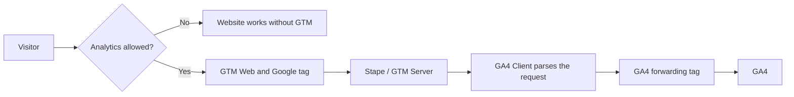

# DataPulse — Marketing Analytics & Server-Side Measurement

[Português](README.md) · **English**

A multilingual landing page for a fictional consultancy, demonstrating measurement with **GTM Web, GA4, GTM Server and prior consent**.

The project follows an interaction from interface to event, transport, measurement server and analytics platform. The front end provides a test environment; measurement implementation and validation are the main focus.

## Current status

- Responsive interface in Portuguese, English and Spanish.
- Header language selector with browser persistence.
- Validated form with local confirmation and a WhatsApp demonstration.
- GTM Web loads only after Analytics consent.
- Events routed through a Stape-hosted Server container to GA4.
- Measurement and consent flows validated during development.
- Automated publishing is configured in .github/workflows/pages.yml; GitHub Pages activation and the first deployment are pending.
- Remote GTM/GA4 configurations are not exported as versioned JSON in this repository.

> The form does not register real leads. Success is simulated in the browser. Stape hosts the measurement server, not a lead-registration backend.

## Run locally

Requirement: a supported Node.js LTS release. No npm dependencies, installation or build step.

```sh
node preview.cjs
```

Open http://127.0.0.1:4173/. Stop the server with Ctrl+C in its terminal. It only listens on the local machine.

## Architecture



The Google tag uses server_container_url to route collection. The Client parses the incoming protocol; the Server tag forwards events to their destination. This does not turn visual success into proof of a stored registration.

## Events

| Event | Source / rule | Current limitation |
| --- | --- | --- |
| page_view | Google tag | Requires Analytics consent |
| scroll | GA4 enhanced measurement | Managed in GA4 |
| form_start | GA4 enhanced measurement | May occur when interacting with the form |
| generate_lead | Visibility of #success, 1%, DOM observation enabled | Once per page load; simulated success |
| whatsapp_click | Click matching button.whatsapp-link or its descendants | Contact-section button only |
| cta_click | Custom-event experiment | Tag paused |

The floating button is not included in the published WhatsApp trigger. Resetting the form does not reset GTM's once-per-page rule.

Event names, IDs, classes, option values and data-* attributes remain unchanged across languages. Switching languages does not reload the page or send a manual event. Existing authorized GTM listeners may still observe the interaction.

## Consent and privacy

Without a valid choice, GTM does not load. Users can accept Analytics, reject optional cookies or customize their choice. Advertising consent remains denied even under “Accept all”, because advertising is not an offered category.

The choice is stored in localStorage for up to 180 days. Users can revoke through the footer. Saving reloads the page and clears the in-memory form. The implementation disables the GA4 property before navigation and attempts to remove accessible Analytics cookies on the current domain. It does not delete data already sent.

Language preference uses separate functional local storage, independent of Analytics consent. Name and email fields are not intentionally copied into the dataLayer.

This is a custom consent control for the lab's scope, not a certified CMP or a legal compliance claim. New vendors require reviewing categories and blocking rules in both Web and Server containers.

## Structure

| Path | Responsibility |
| --- | --- |
| dist/index.html | Structure, form, dialogs and language selector |
| dist/styles.css | Dark theme, responsive layout and UI states |
| dist/app.js | Local interactions and simulated form |
| dist/i18n.js | PT/EN/ES catalog, language switching and translated validation |
| dist/tracking.js | Consent and conditional GTM loading |
| .github/workflows/pages.yml | Validation and automatic deployment of dist |
| preview.cjs | Local static server with an explicit file allowlist |
| docs/MAINTENANCE.md | Bilingual maintenance and publication guide |
| docs/TESTING.md | Bilingual test matrix and evidence |
| docs/ROADMAP.md | Planned improvements |
| CONSENTIMENTO.md | Initial consent implementation notes, in Portuguese |
| CHANGELOG.md | Documented change history |

## Documentation and future work

See [maintenance and publishing](docs/MAINTENANCE.md), [testing](docs/TESTING.md), [roadmap](docs/ROADMAP.md) and [change history](CHANGELOG.md).

The dist directory is the hosting artifact. Do not publish diagnostic files, credentials or .openai. To reuse this project, replace the GTM and GA4 IDs in tracking.js and configure your own containers. Public measurement IDs are not passwords; tokens and credentials must never be committed.

Static website hosting is independent of Server container hosting. Stape availability and quotas must be monitored separately.

## Requirements for real leads

Before accepting real leads: add a backend, confirm persistence before reporting success, protect against abuse, deduplicate submissions, define retention and review privacy requirements. These differences are documented so this demonstration is not mistaken for a complete commercial system.

