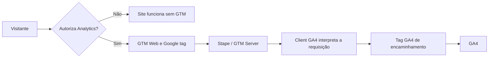

# DataPulse — Marketing Analytics & Server-Side Measurement

**Português** · [English](README.en.md)

Landing page multilíngue de uma consultoria fictícia, criada para demonstrar uma implementação de mensuração com **GTM Web, GA4, GTM Server e consentimento prévio**.

O objetivo é apresentar o caminho completo de uma interação: interface → evento → transporte → servidor de mensuração → plataforma de análise. O front-end serve como ambiente de teste; a implementação e validação de mensuração são o foco do projeto.

## Estado atual

- Interface responsiva em português, inglês e espanhol.
- Idioma selecionável no cabeçalho, persistido no navegador.
- Formulário com validação e confirmação local; WhatsApp demonstrativo.
- GTM Web carregado somente após autorização de Analytics.
- Eventos encaminhados pelo contêiner Server na Stape para o GA4.
- Fluxos de mensuração e consentimento validados durante o desenvolvimento.
- Publicação automatizada preparada em .github/workflows/pages.yml; ativação e primeira implantação no GitHub Pages pendentes.
- Configurações remotas de GTM/GA4 não estão versionadas em JSON neste repositório.

> O formulário não cadastra leads reais. A confirmação é simulada no navegador. O servidor Stape é de mensuração, não um backend de cadastro.

## Executar

Pré-requisito: Node.js em uma versão LTS suportada. Sem dependências npm, instalação ou compilação.

```sh
node preview.cjs
```

Abra http://127.0.0.1:4173/. Para encerrar, pressione Ctrl+C no terminal que iniciou o servidor. O servidor fica restrito à máquina local.

## Arquitetura



A Google tag usa server_container_url para encaminhar a coleta. O Client interpreta o protocolo recebido; a tag Server decide o envio ao destino. Isso não transforma um sucesso visual em confirmação de cadastro real.

## Eventos

| Evento | Origem / regra | Limite atual |
| --- | --- | --- |
| page_view | Google tag | Consentimento Analytics exigido |
| scroll | Mensuração otimizada do GA4 | Configuração administrada no GA4 |
| form_start | Mensuração otimizada do GA4 | Pode ocorrer ao interagir com o formulário |
| generate_lead | Visibilidade de #success, 1%, observar alterações do DOM | Uma vez por carregamento da página; sucesso simulado |
| whatsapp_click | Clique correspondente a button.whatsapp-link ou seus descendentes | Apenas botão junto ao formulário |
| cta_click | Experimento com evento personalizado | Tag pausada |

O botão flutuante não está incluído no acionador WhatsApp publicado. Reiniciar o formulário não reinicia a regra de uma ocorrência por página do GTM.

Nomes de eventos, IDs, classes, valores das opções e atributos data-* não mudam com o idioma. Alterar o idioma não envia evento manual nem recarrega a página. A interação ainda pode ser observada pelos listeners do GTM já autorizado.

## Consentimento e privacidade

Sem escolha válida, GTM não carrega. O usuário pode aceitar Analytics, recusar ou personalizar. Consentimentos de publicidade permanecem negados, mesmo em “Aceitar todos”, porque publicidade não é uma categoria oferecida.

A escolha é salva em localStorage por até 180 dias. O rodapé permite revogar; salvar recarrega a página e apaga o formulário em memória. A implementação desabilita a propriedade GA4 antes da navegação e tenta remover cookies Analytics acessíveis no domínio atual. Dados anteriormente enviados não são apagados.

O idioma usa armazenamento local funcional, separado da autorização de Analytics. Nenhum campo de nome ou e-mail é copiado intencionalmente para o dataLayer.

Este é um controle próprio de consentimento para o escopo do laboratório, não uma CMP certificada nem uma declaração de conformidade jurídica. Novos fornecedores exigem revisão de categorias e bloqueios no Web e no Server.

## Estrutura

| Caminho | Responsabilidade |
| --- | --- |
| dist/index.html | Estrutura, formulário, diálogos e seletor de idioma |
| dist/styles.css | Tema escuro, responsividade e estados de interface |
| dist/app.js | Interações locais e formulário simulado |
| dist/i18n.js | Catálogo PT/EN/ES, troca de idioma e validação traduzida |
| dist/tracking.js | Consentimento e carregamento condicional do GTM |
| .github/workflows/pages.yml | Validação e publicação automática de dist |
| preview.cjs | Servidor estático local, com lista explícita de arquivos |
| docs/MAINTENANCE.md | Guia bilíngue de manutenção e publicação |
| docs/TESTING.md | Matriz bilíngue de testes e evidências |
| docs/ROADMAP.md | Melhorias planejadas |
| CONSENTIMENTO.md | Notas da implementação inicial de consentimento |
| CHANGELOG.md | Histórico das alterações documentadas |

## Documentação e evolução

Leia [manutenção e publicação](docs/MAINTENANCE.md), [testes](docs/TESTING.md), [roadmap](docs/ROADMAP.md) e [histórico](CHANGELOG.md).

A pasta dist é o artefato de hospedagem. Não publique arquivos de diagnóstico, credenciais ou a pasta .openai. Para reutilizar, substitua o ID GTM e o ID GA4 em tracking.js e configure seus próprios contêineres. Os identificadores públicos não são senhas; tokens e credenciais nunca devem entrar no repositório.

A hospedagem estática do site é independente da hospedagem do contêiner Server. A disponibilidade e os limites da Stape devem ser acompanhados separadamente.

## Critérios para uso real

Antes de captar leads reais: adicionar backend, confirmar persistência antes de emitir sucesso, proteger contra abuso, implementar deduplicação por envio, definir política de retenção e revisar privacidade. A documentação registra essas diferenças para que a demonstração não seja confundida com um sistema comercial concluído.

